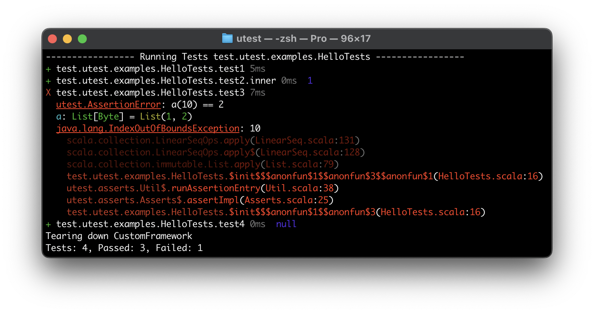
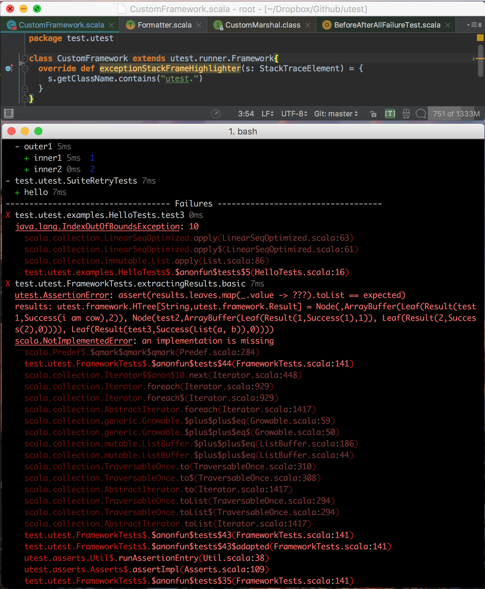

µTest 0.7.2 [![Build Status][travis-badge]][travis-link] [![Gitter Chat][gitter-badge]][gitter-link]
====================================================================================================

[travis-badge]: https://travis-ci.org/lihaoyi/utest.svg
[travis-link]: https://travis-ci.org/lihaoyi/utest
[gitter-badge]: https://badges.gitter.im/Join%20Chat.svg
[gitter-link]: https://gitter.im/lihaoyi/utest?utm_source=badge&utm_medium=badge&utm_campaign=pr-badge&utm_content=badge



uTest (pronounced micro-test) is a simple, intuitive testing library for Scala.
Its key features are:

- Nicely formatted, colored, easy-to-read command-line test output
- [Single uniform syntax for defining tests and grouping them together](#nesting-tests)
- [Single uniform syntax for running test suites and individual tests](#running-tests)
- [Single uniform syntax for Smart Asserts](#smart-asserts), instead of multiple
  redundant `must_==`/`must beEqual`/`should be` opertors
- [Isolation-by-default for tests in the same suite](#sharing-setup-code-and-sharing-setup-objects)
- Supports every version of Scala under the sun:
  [Scala.js and Scala-Native](#scalajs-and-scala-native), Scala 2.13.0-M2,
  projects using [SBT](#getting-started) or
  [standalone](#running-utest-standalone) (e.g. via a `main` method, or in
  Ammonite Scripts)

Unlike traditional testing libraries for Scala (like
[Scalatest](http://www.scalatest.org/) or
[Specs2](https://etorreborre.github.io/specs2/)) uTest aims to be simple enough
you will never "get lost" in its codebase and functionality, so you can focus on
what's most important: your tests.

While uTest has many fewer features than other libraries,
the features that it does provide are polished and are enough to build
and maintain test suites of any size. uTest is used for countless projects, from
the 1-file test suite for
[Fansi](https://github.com/lihaoyi/fansi/blob/master/fansi/shared/src/test/scala/fansi/FansiTests.scala)
to the 50-file 9,000-line test suite for [Ammonite](https://github.com/lihaoyi/Ammonite)

If you use uTest and like it, please support it by donating to our Patreon:

- [https://www.patreon.com/lihaoyi](https://www.patreon.com/lihaoyi)

Contents
--------

- [Getting Started](#getting-started)
- [Defining and Running a Test Suite](#defining-and-running-a-test-suite)
  - [Nesting Tests](#nesting-tests)
  - [Running Tests](#running-tests)
  - [Sharing Setup Code, and Sharing Setup Objects](#sharing-setup-code-and-sharing-setup-objects)
  - [Other Ways of Naming tests](#other-ways-of-naming-tests)
  - [Asynchronous Tests](#asynchronous-tests)
- [Smart Asserts](#smart-asserts)
  - [Arrow Asserts](#arrow-asserts)
  - [Intercept](#intercept)
  - [Eventually and Continually](#eventually-and-continually)
  - [Assert Match](#assert-match)
  - [Compile Error](#compile-error)
- [Test Utilities](#test-utilities)
  - [TestPath](#testpath)
  - [Local Retries](#local-retries)
- [Configuring uTest](#configuring-utest)
  - [Output Formatting](#output-formatting)
  - [Suite Retries](#suite-retries)
  - [Running code before and after test cases](#running-code-before-and-after-test-cases)
  - [Running code before and after test suites](#running-code-before-and-after-test-suites)
  - [Test Wrapping](#test-wrapping)
  - [Per-Run Setup/Teardown, and other test-running Config](#per-run-setupteardown-and-other-test-running-config)
- [Scala.js and Scala-Native](#scalajs-and-scala-native)
- [Running uTest Standalone](#running-utest-standalone)
- [Why uTest](#why-utest)
- [Changelog](#changelog)

Getting Started
===============

Most people coming to uTest will be running tests through
[SBT](http://www.scala-sbt.org/). Add the following to your `build.sbt` and you
can immediately begin defining and running tests programmatically.


```scala
libraryDependencies += "com.lihaoyi" %% "utest" % "0.7.2" % "test"

testFrameworks += new TestFramework("utest.runner.Framework")
```

To use it with Scala.js or Scala-Native:

```scala
libraryDependencies += "com.lihaoyi" %%% "utest" % "0.7.2" % "test"

testFrameworks += new TestFramework("utest.runner.Framework")
```

For Scala-Native, you will also need

```scala
nativeLinkStubs := true
```

Defining and Running a Test Suite
=================================

Put this in your `src/test/scala/` folder:

```scala
package test.utest.examples

import utest._

object HelloTests extends TestSuite{
  val tests = Tests{
    test("test1"){
      throw new Exception("test1")
    }
    test("test2"){
      1
    }
    test("test3"){
      val a = List[Byte](1, 2)
      a(10)
    }
  }
}
```

You can then run this via

```text
sbt myproject/test
```

Which should produce this output:

```text
-------------------------------- Running Tests --------------------------------
Setting up CustomFramework
X test.utest.examples.HelloTests.test1 4ms
  java.lang.Exception: test1
    test.utest.examples.HelloTests$.$anonfun$tests$2(HelloTests.scala:7)
+ test.utest.examples.HelloTests.test2.inner 0ms  1
X test.utest.examples.HelloTests.test3 0ms
  java.lang.IndexOutOfBoundsException: 10
    scala.collection.LinearSeqOptimized.apply(LinearSeqOptimized.scala:63)
    scala.collection.LinearSeqOptimized.apply$(LinearSeqOptimized.scala:61)
    scala.collection.immutable.List.apply(List.scala:86)
    test.utest.examples.HelloTests$.$anonfun$tests$5(HelloTests.scala:16)
Tearing down CustomFramework
Tests: 3, Passed: 1, Failed: 2
```

The tests are run one at a time, and any tests that fail with an exception have
their stack trace printed. If the number of tests is large, a separate
results-summary and failures-summary will be shown after all tests have run.

Nesting Tests
-------------

Note that tests within the suite can nested within each other, but only
directly. E.g. you cannot define tests within `if`-statements or `for`-loops.
uTest relies on the test structure to be statically known at compile time. They
can be nested arbitrarily deep:

```scala
package test.utest.examples


import utest._

object NestedTests extends TestSuite{
  val tests =  Tests{
    val x = 1
    test("outer1"){
      val y = x + 1

      test("inner1"){
        assert(x == 1, y == 2)
        (x, y)
      }
      test("inner2"){
        val z = y + 1
        assert(z == 3)
      }
    }
    test("outer2"){
      test("inner3"){
        assert(x > 1)
      }
    }
  }
}
```

Here, we have a tree of nested blocks, with three tests at the inner-most blocks
of this tree: `innerest`, `inner2` and `inner3`. Test blocks can be nested
arbitrary deeply to help keep things neat, and only the inner-most blocks are
considered to be tests.

When this suite is run with
`sbt myproject/test`, it is those three tests that get executed:

```text
------------------------------- Running Tests -------------------------------
+ test.utest.examples.NestedTests.outer1.inner1 21ms  (1,2)
+ test.utest.examples.NestedTests.outer1.inner2 0ms
+ test.utest.examples.NestedTests.outer2.inner3 0ms
```

You can see also that `test.utest.examples.NestedTests.outer1.inner1` displays
the value of `(x, y)` returned from the test: `(1,2)`. Returning a value from a
test is useful if you want to skim the test's results after a run to perform
manual sanity-checks on some computed value.

If you find yourself wanting to define a test in a for, loop, e.g.

```scala
// Doesn't work!
val tests =  Tests{
  for(fileName <- Seq("hello", "world", "i", "am", "cow")){
    fileName - {
      // lots of code using fileName
    }
  }
}
```

You can instead factor out the common code into a function, and call that from
each distinct test case:

```scala
// Works!
val tests = Tests{
  def runTestChecks(fileName: String) = {
    // lots of code using fileName
  }
  test("hello"){ runTestChecks("hello") }
  test("world"){ runTestChecks("world") }
  test("i"){ runTestChecks("i") }
  test("am"){ runTestChecks("am") }
  test("cow"){ runTestChecks("cow") }
}
```

Or even using the [TestPath](#testpath) that is available implicitly to every
test, you can remove the duplication between the test name and the call to
`runTestChecks()`:

```scala
# Also works!
val tests = Tests{
  def runTestChecks()(implicit path: utest.framework.TestPath) = {
    val fileName = path.value.last
    // lots of code using fileName
  }
  test("hello"){ runTestChecks() }
  test("world"){ runTestChecks() }
  test("i"){ runTestChecks() }
  test("am"){ runTestChecks() }
  test("cow"){ runTestChecks() }
}
```

Running Tests
-------------

Apart from running all tests at once using

```
sbt myproject/test
```

You can also run individual tests using their full path e.g.

```sh
sbt 'myproject/test-only -- test.utest.examples.NestedTests.outer1.inner1'
sbt 'myproject/test-only -- test.utest.examples.NestedTests.outer2.inner2'
sbt 'myproject/test-only -- test.utest.examples.NestedTests.outer2.inner3'
```

You can also wrap the test selector in double quotes, which lets you run test
whose path segments contain spaces or other special characters:

```sh
sbt 'myproject/test-only -- "test.utest.examples.NestedTests.segment with spaces.inner"'
```

You can run groups of tests by providing the path to the block enclosing all of
them:

```sh
# runs both tests `inner1` and `inner2`
sbt 'myproject/test-only -- test.utest.examples.NestedTests.outer1'

# runs all tests in the `NestedTests` test suite
sbt 'myproject/test-only -- test.utest.examples.NestedTests'

# runs all tests in `NestedTests` and any other suites within `test.utest.examples`
sbt 'myproject/test-only -- test.utest.examples'
```

You can also use the `{foo,bar}` syntax to specify exactly which tests you would
like to run:

```sh
# runs both tests `inner2` and `inner3`, explicitly
sbt 'myproject/test-only -- test.examples.NestedTests.outer1.{inner1,inner2}'

# runs `outer1.inner1` and `outer2.inner3` but not `outer1.inner2`
sbt 'myproject/test-only -- test.examples.NestedTests.{outer1.inner1,outer2.inner3}'

# also runs `inner1` and `innerest` (and any other test inside `inner1`) but not `inner2`
sbt 'myproject/test-only -- test.examples.NestedTests.{outer1.inner1,outer2}'
```

The same syntax can be used to pick and choose specific `TestSuite`s to run, or
tests within those test suites:

```sh
# Run every test in `HelloTests` and `NestedTests`
sbt 'myproject/test-only -- test.examples.{HelloTests,NestedTests}'

# Runs `HelloTests.test1`, `NestedTests.outer1.inner2` and `NestedTests.outer2.inner3`
sbt 'myproject/test-only -- test.examples.{HelloTests.test1,NestedTests.outer2}'
sbt 'myproject/test-only -- {test.examples.HelloTests.test1,test.examples.NestedTests.outer2}'
```

In general, it doesn't really matter if you are running individual tests, groups
of tests within a `TestSuite`, individual `TestSuite`s, or packages containing
`TestSuite`. These all form one a single large tree of tests that you can run,
using the same uniform syntax.

By default, SBT runs multiple test suites in parallel, so the output from
those suites may be interleaved. You can set `parallelExecution in Test := false`
in your SBT config to make the tests execute sequentially, so the output from
each suite will be grouped together in the terminal.

uTest defaults to emitting ANSI-colored terminal output describing the test run.
You can configure the colors by
[overriding methods on your test suite](#output-formatting), or disable it
altogether with `override def formatColor = false`.

Sharing Setup Code, and Sharing Setup Objects
---------------------------------------------

As you saw in the previous section, you can define blocks tests to group them
together, and have them share common initialization code in the enclosing block.
You can also define *mutable* values, or "fixtures" in the shared initialization
code, and each nested test with a `Tests` block gets its own copy of any mutable
variables defined within it:

```scala
package test.utest.examples

import utest._

object SeparateSetupTests extends TestSuite{
  val tests = Tests{
    var x = 0
    test("outer1"){
      x += 1
      test("inner1"){
        x += 2
        assert(x == 3) // += 1, += 2
        x
      }
      test("inner2"){
        x += 3
        assert(x == 4) // += 1, += 3
        x
      }
    }
    test("outer2"){
      x += 4
      test("inner3"){
        x += 5
        assert(x == 9) // += 4, += 5
        x
      }
    }
  }
}
```

Here, you can see that the `x` available in each inner test block (`inner1`,
`inner2`, `inner3`) is separate and independent: each test gets a new copy of
`x`, modified only by that test's enclosing blocks. This helps avoid inter-test
interference (where a test ends up implicitly depending on some state
initialized by another test running earlier in the block) while still making it
convenient to share common setup code between the various tests in your suite.

If you want the mutable fixtures to really-truly be shared between individual
tests (e.g. because they are expensive to repeatedly initialize) define it
outside the `Tests{}` block in the enclosing object:

```scala
package test.utest.examples

import utest._

object SharedFixturesTests extends TestSuite{
  var x = 0
  val tests = Tests{
    test("outer1"){
      x += 1
      test("inner1"){
        x += 2
        assert(x == 3) // += 1, += 2
        x
      }
      test("inner2"){
        x += 3
        assert(x == 7) // += 1, += 2, += 1, += 3
        x
      }
    }
    test("outer2"){
      x += 4
      test("inner3"){
        x += 5
        assert(x == 16) // += 1, += 2, += 1, += 3, += 4, += 5
        x
      }
    }
  }
}
```

Here you see that the changes to `x` are being shared between the invocations of
all the tests. If you are initializing something expensive to share between
tests, this allows you to avoid paying that cost multiple times, but you need to
be careful the tests aren't mutating shared state that could cause other tests
to fail!

Other Ways of Naming tests
--------------------------

You can also use the `test("symbol") -` syntax, if your tests are simply forwarding
to a separate helper method to do the real testing:

```scala
test("test1") - processFileAndCheckOutput("input1.txt", "expected1.txt")
test("test2") - processFileAndCheckOutput("input2.txt", "expected2.txt")
test("test3") - processFileAndCheckOutput("input3.txt", "expected3.txt")
```

The `test("string"){...}` and `test("symbol")...` syntaxes are equivalent.

The last way of defining tests is with the `utest.*` symbol, e.g. these tests
from the [Fansi](https://github.com/lihaoyi/fansi/blob/master/fansi/shared/src/test/scala/fansi/FansiTests.scala)
project:

```scala
test("parsing"){
  def check(frag: fansi.Str) = {
    val parsed = fansi.Str(frag.render)
    assert(parsed == frag)
    parsed
  }
  test{ check(fansi.Color.True(255, 0, 0)("lol")) }
  test{ check(fansi.Color.True(1, 234, 56)("lol")) }
  test{ check(fansi.Color.True(255, 255, 255)("lol")) }
  test{
    (for(i <- 0 to 255) yield check(fansi.Color.True(i,i,i)("x"))).mkString
  }
  test{
    check(
      "#" + fansi.Color.True(127, 126, 0)("lol") + "omg" + fansi.Color.True(127, 126, 0)("wtf")
    )
  }

  test{ check(square(for(i <- 0 to 255) yield fansi.Color.True(i,i,i))) }
}
```

Tests defined using the `*` symbol are give the numerical names "0", "1", "2",
etc.. This is handy if you have a very large number of very simple test cases,
don't really care what each one is called, but still want to be able to run them
and collect their result separately.

Asynchronous Tests
------------------

```scala
val tests = Tests {
  test("testSuccess"){
    Future {
      assert(true)
    }
  }
  test("testFail"){
    Future {
      assert(false)
    }
  }
  test("normalSuccess"){
    assert(true)
  }
  test("normalFail"){
    assert(false)
  }
}

TestRunner.runAsync(tests).map { results =>
 val leafResults = results.leaves.toSeq
 assert(leafResults(0).value.isSuccess) // root
 assert(leafResults(1).value.isSuccess) // testSuccess
 assert(leafResults(2).value.isFailure) // testFail
 assert(leafResults(3).value.isSuccess) // normalSuccess
}
```

You can have tests which return (have a last expression being) a `Future[T]`
instead of a normal value. You can run the suite using `.runAsync` to return a
`Future` of the results, or you can continue using `.run` which will wait for
all the futures to complete before returning.

In Scala.js, calling `.run` on a test suite with futures in it throws an error
instead of waiting, since you cannot wait for asynchronous results in Scala.js.

When running the test suites from SBT, you do not need worry about any of this
`run` vs `runAsync` stuff: the test runner will handle it for you and provide
the correct results.

Smart Asserts
=============

```scala
val x = 1
val y = "2"
assert(
  x > 0,
  x == y
)

// utest.AssertionError: x == y
// x: Int = 1
// y: String = 2
```

uTest comes with a macro-powered smart `assert`s that provide useful debugging
information in the error message. These take one or more boolean expressions,
and when they fail, will print out the names, types and values of any local
variables used in the expression that failed. This makes it much easier to see
what's going on than Scala's default `assert`, which gives you the stack trace
and nothing else.

uTest also wraps any exceptions thrown within the assert, to help trace what
went wrong:

```scala
val x = 1L
val y = 0L
assert(x / y == 10)

// utest.AssertionError: assert(x / y == 10)
// caused by: java.lang.ArithmeticException: / by zero
// x: Long = 1
// y: Long = 0
```

The origin exception is stored as the `cause` of the `utest.AssertionError`, so
the original stack trace is still available for you to inspect.

uTest's smart asserts live on the `utest` package, and are brought into scope
via `import utest._`. If you want to continue using the built-in Scala asserts,
e.g. if you want custom messages if the assert fails, those remain available as
`Predef.assert`.

Arrow Asserts
-------------

```scala
1 ==> 1 // passes
Array(1, 2, 3) ==> Array(1, 2, 3) // passes
try{
  1 ==> 2 // throws
}catch{case e: java.lang.AssertionError =>
  e
}
```

You can use `a ==> b` as a shorthand for `assert(a == b)`. This results in
pretty code you can easily copy-paste into documentation.

Intercept
---------

```scala
val e = intercept[MatchError]{
  (0: Any) match { case _: String => }
}
println(e)

// scala.MatchError: 0 (of class java.lang.Integer)
```

`intercept` allows you to verify that a block raises an exception. This
exception is caught and returned so you can perform further validation on it,
e.g. checking that the message is what you expect. If the block does not raise
one, an `AssertionError` is raised.

As with `assert`, `intercept` adds debugging information to the error messages
if the `intercept` fails or throws an unexpected Exception.

Eventually and Continually
--------------------------

```scala
val x = Seq(12)
eventually(x == Nil)

// utest.AssertionError: eventually(x == Nil)
// x: Seq[Int] = List(12)
```

In addition to a macro-powered `assert`, uTest also provides macro-powered
versions of `eventually` and `continually`. These are used to test asynchronous
concurrent operations:

- `eventually(tests: Boolean*)`: ensure that the boolean values of `tests` all
  become true at least once within a certain period of time.
- `continually(tests: Boolean*)`: ensure that the boolean values of `tests` all
  remain true and never become false within a certain period of time.

These are implemented via a retry-loop, with a default retry interval of 0.1
second and retries up to a total of 1 second. If you want to change this
behavior, you can shadow the implicit values `retryInterval` and `retryMax`, for
example this:

```scala
implicit val retryMax = RetryMax(300.millis)
implicit val retryInterval = RetryInterval(50.millis)
```

Would set the retry-loop to happen every 50ms up to a max of 300ms.

Together, these two operations allow you to easily test asynchronous operations.
You can use them to help verify Liveness properties (that condition must
eventually be met) and Safety properties (that a condition is never met)

As with `assert`, `eventually` and `continually` add debugging information to
the error messages if they fail.

Assert Match
------------

```scala
assertMatch(Seq(1, 2, 3)){case Seq(1, 2) =>}
// AssertionError: Matching failed Seq(1, 2, 3)
```

`assertMatch` is a convenient way of checking that a value matches a particular
shape, using Scala's pattern matching syntax. This includes support for use of
`|` or `_` or `if`-guards within the pattern match. This gives you additional
flexibility over a traditional `assert(a == Seq(1, 2))`, as you can use `_` as a
wildcard e.g. using `assertMatch(a){case Seq(1, _)=>}` to match any 2-item `Seq`
whose first item is `1`.

As with `assert`, `assertMatch` adds debugging information to the error messages
if the value fails to match or throws an unexpected Exception while evaluating.

Compile Error
-------------

```scala
compileError("true * false")
// CompileError.Type("value * is not a member of Boolean")

compileError("(}")
// CompileError.Parse("')' expected but '}' found.")
```

`compileError` is a macro that can be used to assert that a fragment of code
(given as a literal String) fails to compile.

- If the code compiles successfully, `compileError` will fail the compilation
  run with a message.
- If the code fails to compile, `compileError` will return an instance of
  `CompileError`, one of `CompileError.Type(pos: String, msgs: String*)` or
  `CompileError.Parse(pos: String, msgs: String*)` to represent typechecker
  errors or parser errors

In general, `compileError` works similarly to `intercept`, except it does its
checks (that a snippet of code fails) and errors (if it doesn't fail) at
compile-time rather than run-time. If the code fails as expected, the failure
message is propagated to runtime in the form of a `CompileError` object. You can
then do whatever additional checks you want on the failure message, such as
verifying that the failure message contains some string you expect to be there.

The `compileError` macro compiles the given string in the local scope and
context. This means that you can refer to variables in the enclosing scope, i.e.
the following example will fail to compile because the variable `x` exists.

```scala
val x = 0

compileError("x + x"),
// [error] compileError check failed to have a compilation error
```

The returned `CompileError` object also has a handy `.check` method, which takes
a position-string indicating where the error is expected to occur, as well as
zero-or-more messages which are expected to be part of the final error message.
This is used as follows:

```scala
compileError("true * false").check(
  """
compileError("true * false").check(
                   ^
  """,
  "value * is not a member of Boolean"
)
```

Note that the position-string needs to exactly match the line of code the
compile-error occured on. This includes any whitespace on the left, as well as
any unrelated code or comments sharing the same line as the `compileError`
expression.

Test Utilities
==============

uTest provides a range of test utilities that aren't strictly necessary, but aim
to make your writing of tests much more convenient and DRY.


TestPath
--------

```scala
package test.utest.examples

import utest._

object TestPathTests extends TestSuite{
  val tests = Tests{
    'testPath{
      'foo {
        assert(implicitly[utest.framework.TestPath].value == Seq("testPath", "foo"))
      }
    }
  }
}
```

uTest exposes the path to the current test to the body of the test via the
`utest.framework.TestPath` implicit. This can be used to print debugging
information while the test is running ("test foo.bar.baz 50% done") or to
avoid repetition between the test name and test body.

One example is the Fastparse test suite, which uses the name of the test to
provide the repository that it needs to clone and parse:

```scala
def checkRepo(filter: String => Boolean = _ => true)
             (implicit testPath: utest.framework.TestPath) = {
  val url = "https://github.com/" + testPath.value.last
  import sys.process._
  val name = url.split("/").last
  if (!Files.exists(Paths.get("target", "repos", name))){
    println("CLONING")
    Seq("git", "clone", url, "target/repos/"+name, "--depth", "1").!
  }
  checkDir("target/repos/"+name, filter)
}

"lihaoyi/fastparse" - checkRepo()
"scala-js/scala-js" - checkRepo()
"scalaz/scalaz" - checkRepo()
"milessabin/shapeless" - checkRepo()
"akka/akka"- checkRepo()
"lift/framework" - checkRepo()
"playframework/playframework" - checkRepo()
"PredictionIO/PredictionIO" - checkRepo()
"apache/spark" - checkRepo()
```

This allows us to keep the tests DRY - avoiding having to repeat the name of the
repo in the name of the test for every test we define - as well as ensuring that
they always stay in sync.

If you need additional metadata such as line-numbers or file-paths or class or
package names, you can use the
[SourceCode](https://github.com/lihaoyi/sourcecode) library's implicits to pull
them in for you.

Local Retries
-------------

```scala
object LocalRetryTests extends utest.TestSuite{
  val flaky = new FlakyThing
  def tests = Tests{
    test("hello") - retry(3){
      flaky.run
    }
  }
}
```

You can wrap individual tests, or even individual expressions, in a `retry`
block to make them retry a number of times before failing. That is very useful
for dealing with small points of flakiness within your test suite. A `retry`
block simply retries its body up to the specified number of times; the first run
that doesn't throw an exception returns the value returned by that run.

You can also use [Suite Retries](#suite-retries) if you want to configure
retries more globally across your test suite.

Configuring uTest
=================

Per-Run Setup/Teardown, and other test-running Config
-----------------------------------------------------

To configure things which affect an entire test run, and not any individual
`TestSuite` object, you can create your own subclass of `utest.runner.Framework`
and override the relevant methods.

For example, if you need to perform some action (initialize a database, cleanup
the filesystem, etc.) not just per-test but per-run, you can do that by defining
a custom `utest.runner.Framework` and overriding the `setup` and `teardown`
methods:

```scala
class CustomFramework extends utest.runner.Framework{
  override def setup() = {
    println("Setting up CustomFramework")
  }
  override def teardown() = {
    println("Tearing down CustomFramework")
  }
}
```

And then telling SBT to run tests using the custom framework:

```scala
testFrameworks += new TestFramework("test.utest.CustomFramework"),
```

This is handy for setup/teardown that is necessary but too expensive to do
before/after every single test, which would be the case if you used
[Test Wrapping](#test-wrapping) to do it.

Apart from setup and teardown, there are other methods on
`utest.runner.Framework` that you can override to customize:

```scala
  /**
    * Override to run code before tests start running. Useful for setting up
    * global databases, initializing caches, etc.
    */
  def setup() = ()

  /**
    * Override to run code after tests finish running. Useful for shutting
    * down daemon processes, closing network connections, etc.
    */
  def teardown() = ()

  /**
    * How many tests need to run before uTest starts printing out the test
    * results summary and test failure summary at the end of a test run. For
    * small sets of tests, these aren't necessary since all the output fits
    * nicely on one screen; only when the number of tests gets large and their
    * output gets noisy does it become valuable to show the clean summaries at
    * the end of the test run.
    */
  def showSummaryThreshold = 30

  /**
    * Whether to use SBT's test-logging infrastructure, or just println.
    *
    * Defaults to println because SBT's test logging doesn't seem to give us
    * anything that we want, and does annoying things like making a left-hand
    * gutter and buffering input by default
    */
  def useSbtLoggers = false

  def resultsHeader = BaseRunner.renderBanner("Results")
  def failureHeader = BaseRunner.renderBanner("Failures")


  def startHeader(path: String) = BaseRunner.renderBanner("Running Tests" + path)
```

Output Formatting
-----------------

You can control how the output of tests gets printed via overriding methods on
the `Framework` class, described above. For example, this snippet overrides the
`exceptionStackFrameHighlighter` method to select which stack frames in a stack
trace are more relevant to you, so they can be rendered more brightly:

```scala
class CustomFramework extends utest.runner.Framework{
  override def exceptionStackFrameHighlighter(s: StackTraceElement) = {
    s.getClassName.contains("utest.")
  }
}
```

This results in stack traces being rendered as such:



the `utest.runner.Framework` provides a wide range of hooks you can use to
customize how the uTest output is colored, wrapped, truncated or formatted:

```scala
def formatColor: Boolean = true
def formatTruncateHeight: Int = 15
def formatWrapWidth: Int = 100

def formatValue(x: Any) = testValueColor(x.toString)

def toggledColor(t: ufansi.Attrs) = if(formatColor) t else ufansi.Attrs.Empty
def testValueColor = toggledColor(ufansi.Color.Blue)
def exceptionClassColor = toggledColor(ufansi.Underlined.On ++ ufansi.Color.LightRed)
def exceptionMsgColor = toggledColor(ufansi.Color.LightRed)
def exceptionPrefixColor = toggledColor(ufansi.Color.Red)
def exceptionMethodColor = toggledColor(ufansi.Color.LightRed)
def exceptionPunctuationColor = toggledColor(ufansi.Color.Red)
def exceptionLineNumberColor = toggledColor(ufansi.Color.LightRed)
def exceptionStackFrameHighlighter(s: StackTraceElement) = true

def formatResultColor(success: Boolean) = toggledColor(
  if (success) ufansi.Color.Green
  else ufansi.Color.Red
)

def formatMillisColor = toggledColor(ufansi.Bold.Faint)
```

Any methods overriden on your own custom `Framework` apply to every `TestSuite`
that is run. If you want to further customize how a single `TestSuite`'s output
is formatted, you can override `utestFormatter` on that test suite.

Note that uTest uses an internal copy of the
[Fansi](https://www.github.com/lihaoyi/fansi) library, vendored at
`utest.ufansi`, in order to avoid any compatibility problems with any of your
other dependencies. You can use `ufansi` to construct the colored `ufansi.Str`s
that these methods require, or you could just return colored `java.lang.String`
objects containing ANSI escapes, created however you like, and they will be
automatically parsed into the correct format.

Suite Retries
-------------

You can mix in the `TestSuite.Retries` trait to any `TestSuite` and define the
`utestRetryCount` int to enable test-level retries for all tests within a suite:

```scala

object SuiteRetryTests extends TestSuite with TestSuite.Retries{
  override val utestRetryCount = 3
  val flaky = new FlakyThing
  def tests = Tests{
    'hello{
      flaky.run
    }
  }
}

```

You can also use [Local Retries](#local-retries) if you want to only retry
within specific tests or expressions instead of throughout the entire suite.

Running code before and after test cases
----------------------------------------

uTest offers the `utestBeforeEach` and `utestAfterEach` methods that you can
override on any `TestSuite`, these methods are invoked before and after running
each test.

```scala
def utestBeforeEach(path: Seq[String]): Unit = ()
def utestAfterEach(path: Seq[String]): Unit = ()
```

These are equivalent to `utestWrap` but easier to use for simple cases.

```scala
package test.utest.examples

import utest._
object BeforeAfterEachTest extends TestSuite {
  var x = 0
  override def utestBeforeEach(path: Seq[String]): Unit = {
    println(s"on before each x: $x")
    x = 0
  }
  override def utestAfterEach(path: Seq[String]): Unit =
    println(s"on after each x: $x")

  val tests = Tests{
    test("outer1"){
      x += 1
      test("inner1"){
        x += 2
        assert(x == 3) // += 1, += 2
        x
      }
      test("inner2"){
        x += 3
        assert(x == 4) // += 1, += 3
        x
      }
    }
    test("outer2"){
      x += 4
      test("inner3"){
        x += 5
        assert(x == 9) // += 4, += 5
        x
      }
    }
  }
}
```
```text
-------------------------------- Running Tests --------------------------------
Setting up CustomFramework
on before each x: 0
on after each x: 3
+ test.utest.examples.BeforeAfterEachTest.outer1.inner1 22ms  3
on before each x: 3
on after each x: 4
+ test.utest.examples.BeforeAfterEachTest.outer1.inner2 1ms  4
on before each x: 4
on after each x: 9
+ test.utest.examples.BeforeAfterEachTest.outer2.inner3 0ms  9
Tearing down CustomFramework
Tests: 3, Passed: 3, Failed: 0
```

Both `utestBeforeEach` and `utestAfterEach` runs inside `utestWrap`'s `body`
callback.

If you need something fancier than what `utestBeforeEach` or `utestAfterEach`
provide, e.g. passing initialized objects into the main test case or tearing
them down after the test case has completed, feel free to define your test
wrapper/initialization function and use it for each test case:


```scala
def myTest[T](func: Int => T) = {
  val fixture = 1337 // initialize some value
  val res = func(fixture) // make the value available in the test case
  assert(fixture == 1337) // properly teardown the value later
  res
}

test("test") - myTest{ fixture =>
  // do stuff with fixture
}
```

The above `myTest` function can also take a [TestPath](#testpath) implicit if it
wants access to the current test's path.

Running code before and after test suites
-----------------------------------------

If you're looking for something like `utestBeforeAll`, you can add your code to
the object body, and you can also use lazy val to delay the initialization until
the test suite object is created.

uTest offers the `utestAfterAll` method that you can override on any
test suite, this method is invoked after running the entire test suite.

```scala
def utestAfterAll(): Unit = ()
```

```scala
package test.utest.examples

import utest._
object BeforeAfterAllSimpleTests extends TestSuite {
  println("on object body, aka: before all")

  override def utestAfterAll(): Unit = {
    println("on after all")
  }

  val tests = Tests {
    test("outer1"){
      test("inner1"){
        1
      }
      test("inner2"){
        2
      }
    }
  }
}

```
```text
-------------------------------- Running Tests --------------------------------
Setting up CustomFramework
on object body, aka: before all
+ test.utest.examples.BeforeAfterAllSimpleTests.outer1.inner1 2ms  1
+ test.utest.examples.BeforeAfterAllSimpleTests.outer1.inner2 0ms  2
on after all
```

Test Wrapping
-------------

uTest exposes the `utestWrap` function that you can override on any test suite:

```scala
def utestWrap(path: Seq[String], runBody: => concurrent.Future[Any])
             (implicit ec: ExecutionContext): concurrent.Future[Any]
```

This is a flexible function that wraps every test call; you can use it to:

- Perform initialization before evaluating `runBody`
- Perform cleanup after the completion of `runBody` via `runBody.onComplete`
- Perform retries by executing `runBody` multiple times
- Log the start and end times of each test, along with the `path` of that test,
  e.g. `Seq("outer", "inner1", "innerest")` for the test `outer.inner1.innerest`

Generally, if you want to perform messy before/after logic around every
individual test, override `utestWrap`. Please remember to call the
`utestBeforeEach` and `utestAfterEach` methods when needed.

`runBody` is a future to support asynchronous testing, which is the only way to
test things like Ajax calls in [Scala.js](#scalajs-and-scala-native)


Scala.js and Scala-Native
=========================

uTest is completely compatible with Scala.js and Scala-Native: the above sections on
defining a test suite, asserts and the test-running API all work unchanged under
ScalaJS, with minor differences:

- ScalaJS does not support parallelism, and as such only single-threaded
  `ExecutionContexts` like `utest.ExecutionContext.runNow` or
  `scala.scalajs.concurrent.JSExecutionContext.runNow` work. When run via SBT,
  `--parallel` has no effect.
- [Eventually and Continually](#eventually-and-continually) are not supported,
  as they rely on a blocking retry-loop whereas you can't block in ScalaJS.

Apart from these differences, there should be no problem compiling uTest
TestSuites via Scala.js and running them on Node.js, in the browser, or (with
Scala-Native) on LLVM.

Note that Scala-Native support, like Scala-Native, is experimental. While it is
tested in a few projects (uTest's own test suite runs in Scala-Native), it does
have it's own quirks (e.g. `NullPointerException`s appear to be fatal) and does
not have the weight of third-party usage that the Scala-JVM and Scala.js
versions of uTest have.

Running uTest Standalone
========================

uTest exposes a straightforward API that allows you to run tests, receive
results and format them in a nice way when used standalone, without using SBT's
test integration. The following code snippet demonstrates how to define tests
and run them directly:

```scala
import utest._
val tests = Tests{
  test("test1"){
    // throw new Exception("test1")
  }
  test("test2"){
    test("inner"){
      1
    }
  }
  test("test3"){
    val a = List[Byte](1, 2)
    // a(10)
  }
}

// Run and return results
val results1 = TestRunner.run(tests)
```

The `TestRunner.run` call can be customized with additional arguments to control
how the code is run, or can be replaced with `.runAsync` to handle asynchronous
testing, or `.runAndPrint`/`.runAndPrintAsync` if you want to print the results
of tests as they complete using the normal output formatter:

```scala

// Run, return results, and print streaming output with the default formatter
val results2 = TestRunner.runAndPrint(
  tests,
  "MyTestSuiteA"
)
// Run, return results, and print output with custom formatter and executor
val results3 = TestRunner.runAndPrint(
  tests,
  "MyTestSuiteA",
  executor = new utest.framework.Executor{
    override def utestWrap(path: Seq[String], runBody: => Future[Any])
                 (implicit ec: ExecutionContext): Future[Any] = {
      println("Getting ready to run " + path.mkString("."))
      utestBeforeEach()
      runBody.andThen {
        case _ => utestAfterEach()
      }
    }
  },
  formatter = new utest.framework.Formatter{
    override def formatColor = false
  }
)
```

Lastly, you can also run `TestSuite` objects in the same way:

```scala
// Run `TestSuite` object directly without using SBT, and use
// its configuration for execution and output formatting
object MyTestSuite extends TestSuite{
  val tests = Tests{
    test("test1"){
      // throw new Exception("test1")
    }
    test("test2"){
      test("inner"){
        1
      }
    }
    test("test3"){
      val a = List[Byte](1, 2)
      // a(10)
    }
  }
}

val results4 = TestRunner.runAndPrint(
  MyTestSuite.tests,
  "MyTestSuiteB",
  executor = MyTestSuite,
  formatter = MyTestSuite
)
```

uTest provides helpers to render the standard summary reports at the end of a
test run, once all your results are in:

```scala
// Show summary and exit
val (summary, successes, failures) = TestRunner.renderResults(
  Seq(
    "MySuiteA" -> results1,
    "MySuiteA" -> results2,
    "MySuiteA" -> results3,
    "MySuiteB" -> results4
  )
)
if (failures > 0) sys.exit(1)
```

You can thus use uTest anywhere you can run Scala code, even when not using SBT:
in a normal `main` method, within [Ammonite](http://ammonite.io/) scripts, or
elsewhere.


Why uTest
=========

uTest aims to give you the things that everyone needs to run tests, giving you
one obvious way to do common tasks while testing. uTest is simple and compact,
letting you avoid thinking about it so you can focus on what's most important:
you tests.

Hence uTest provides:

- A simple, uniform syntax for
  [delimiting tests and grouping tests together as blocks](#nesting-tests):
  `test("test"){ ... }`

- A simple, uniform syntax for [running tests](#running-tests): `foo.BarTests`,
  `foo.BarTests.baz.qux`, `foo.BarTests.{baz,qux}` or `foo.{BarTests,BazTests}`

- A simple, uniform syntax for [Smart Asserts](#smart-asserts), that save you
  the day-to-day drudgery of printing out the value of variables when things
  fail

- [Isolation of tests within the same suite](#sharing-setup-code-and-sharing-setup-objects),
  to avoid inter-test interference due to mutable state

uTest tries to provide things that every developer needs, in their minimal,
essential form. It intentionally avoids redundant/unnecessary features or
syntaxes that bloat the library and make it harder to developers to pick up,
which I find to be common in other popular testing libraries like
[Scalatest](http://www.scalatest.org/) or
[Specs2](https://etorreborre.github.io/specs2/):

- Fluent English-like code: matchers like [`shouldBe` or `should not
  be`](http://www.scalatest.org/user_guide/using_matchers#checkingForEmptiness)
  or [`mustbe_==`](http://etorreborre.github.io/specs2/guide/org.specs2.guide.Matchers.html)
  don't really add anything, and it doesn't really matter whether you name each
  test block using [`should`, `when`, `can`,
  `must`](http://doc.scalatest.org/2.0/#org.scalatest.Spec),
  [`feature("...")`](http://doc.scalatest.org/2.0/#org.scalatest.FlatSpec) or
  [`it should "..."`](http://doc.scalatest.org/2.0/#org.scalatest.FlatSpec)

- [Multiple redundant ways](http://www.scalatest.org/user_guide/selecting_a_style)
  of defining test suites, individual tests and blocks of related tests

- Legacy code, like ScalaTests [time
  package](http://doc.scalatest.org/2.0/#org.scalatest.time.package), now
  obsolete with the introduction of
  [scala.concurrent.duration](http://www.scala-lang.org/api/current/index.html#scala.concurrent.duration.package).

While uTest has and will continue to slowly grow and add more features, it is
unlikely that it will ever reach the same level of complexity that other testing
libraries are currently at.

Changelog
=========

0.7.3
-----

- Add support for Scala.js 1.0.0-RC2

0.7.2
-----

- Add support for Scala.js 1.0.0-RC1

0.7.1
-----

- Changed test syntax to `test("foo"){...}`, `test{...}`. Old syntax is now
  deprecated.

0.6.9
-----

- Added support for Scala 2.13.0 Final
- Dropped support for Scala 2.10.x, 2.11.x
- Temporarily dropped support for Scala.js 1.0.0-M8, Scala-native 0.4.0-M2

0.6.7
-------------------
- Add support for Scala 2.13.0-RC1
- Use IndexedSeq instead of Array in `Tests` macro

0.6.6
-------------------
- Add support for Scala 2.13.0-M5
- Upgrade Scala 2.13.0-M2 to 2.13.0-M3
- Upgrade Scala.JS 0.6.22 to 0.6.25
- Upgrade Scala.JS 1.0.0-M3 to 1.0.0-M5
- Upgrade Scala Native 0.3.6 to 0.3.7
- Replace Scala.JS' deprecated `TestUtils` with portable-scala-reflect

0.6.6
-----
- Bugfix where sometimes all tests would pass but report as failed (thanks @eatkins)
- By default, don't cut-off and wrap output
- (Hopefully) fix intermittent `IllegalStateException: Unknown opcode 5` exceptions occuring with Scala.JS.

0.6.4
-----
- Returning `null` from a test case no longer blows up
- Added `utest.runner.MillFramework`

0.6.3
-----
- Added support for Scala.js 1.0.0-M2.

0.6.2
-----
- Fix cross-publishing for Scala.js, which was borked in 0.6.0
- Ensure utestAfterEach be executed regardless of a test failure

0.6.0
-----

- Migrate formatting-related configuration options from `utest.TestSuite` onto
  the `utest.runner.Framework`, as described [here](#output-formatting).

- Added the `exceptionStackFrameHighlighter` formatting hook, letting you choose
  which stack frames in an exception are of interest to you so they can be
  rendered more brightly.

0.5.4
-----

- Added hooks for
  [Running code before and after test cases](#running-code-before-and-after-test-cases)
  and
  [Running code before and after test suites](#running-code-before-and-after-test-suites),
  thanks to [Diego Alvarez](https://github.com/d1egoaz)

0.5.3
-----

- Cross-publish for Scala 2.13.0-M2, Scala.js 0.6.20, Scala-Native 0.3.3

- Stack traces for chained exceptions (i.e. those with a `.getCause != null`)
  are now properly displayed when tests fail

- Portions of stack traces caused by the internals of the `assert` macros are
  now hidden, since they aren't relevant to any failure in user code

- Revamped test output format, motivated by
  [drhumlen](https://github.com/drhumlen)'s
  [PR 113](https://github.com/lihaoyi/utest/pull/113), which should be much
  easier to read and skim

- Much smarter test-output-value truncation, now based on lines-of-output
  (including wrapping) rather than number-of-characters

- Line-wrapping of output is now indentation aware: it wraps to the next line
  with the same indentation, preserving the outline of indentation on the left
  making it easier to skim

- How long tests take (im milliseconds) is now displayed in the standard test
  output format

- Hierarchical test summary and failure-summary are now only shown when you have
  a large number of tests, since it's not use when running individual or small
  numbers of tests. The default threshold is 20, which can be configured by
  defining a custom framework overriding `showSummaryThreshold`

- Revamped test-query system, now allowing you to run multiple groups of tests
  at once via `test-only -- mypackage.{foo,bar,baz}` or `{mypackage,
  myotherpackage}` or `mypackage.{foo,bar.{baz,qux}}`

- Overhauled the execution model of test suites: now only the inner-most blocks
  within your `TestSuite{...}` block count as tests, and the surrounding blocks
  do not. Thus the surrounding blocks no longer show pass/fail status, return a
  test result-value, or get run independently.

- Various user errors (non-existent test, non-existing test suite, invalid test
  query syntax) now give slightly more friendly error messages

- Using uTest with `fork in Test := true` in SBT no longer gives an incorrect
  results summmary

- Fix problem with lazy vals in test blocks crashing the compiler
  [#67](https://github.com/lihaoyi/utest/issues/67). Note that the issue is only
  fixed on 2.12.3, and not on Scala 2.10.x or 2.11.x.

- Deprecated the `'foo{...}` syntax for defining tests. We should standardize on
  `test("foo"){...}` or `test("foo"){...}`

- The `TestSuite{...}` for defining a block of tests is now deprecated; it never
  actually defined a `TestSuite` object, so the name was pretty misleading. The
  new syntax is `Tests{...}`

- Remove the `MultipleErrors` wrapper when you test more than one expression in
  an `assert` and multiple of them fail. Now only the first expression in the
  `assert` call which fails will have it's exception thrown.

- Moved [smart asserts](#smart-asserts) from being embedded into the `TestSuite`
  objects directly onto the `utest` package, so they are pulled in by the
  `import utest._` import.

0.4.8
-----

- Scala Native support.

0.4.7
-----

- Scala 2.13 support
- Compile for Scala 2.12 with method optimisations (`-opt:l:method`)

0.4.6
-----

* Upgrade Scala.JS to 0.6.16.
* Upgrade Scala to 2.11.11 and 2.12.2.
* Avoid using `getStackTraceString` deprecated in Scala 2.13

0.4.5
-----

- Catch Fatal exceptions like ClassCasts in Scala.JS.

0.4.4
-----

- Scala 2.12 support

0.4.3
-----

- Generalize `==>` asserts to work on `Array`s
- Shiny new [CI build](https://travis-ci.org/lihaoyi/utest) and
  [Gitter Chat](https://gitter.im/lihaoyi/utest?utm_source=badge&utm_medium=badge&utm_campaign=pr-badge&utm_content=badge)

0.4.2
-----

- Move errors into `utest.*` from `utest.framework.*`
- Removed `acyclic` hack variable

0.4.1
-----

- Fix usage of by-name function calls within tests #55

0.4.0
-----

- `foo: @Show` annotation lets you tell uTest to print out arbitrary expressions
  within the test suite when things fail, in addition to the default of local
  variables

- You can use `a ==> b` to assert equality within a test suite, in a form that's
  pretty enough to use as documentation

- `compileError` now properly passes when an expression would fail to compile
  due to `@compileTimeOnly` annotations

- [Configuring uTest](#configuring-utest) has been overhauled.

- Scala `2.12.0-M3` support

- Fix some warnings appearing when the `-Ydead-code` flag is used

- Added [TestPath](#testpath) implicit to make the path to the current test
  available for usage inside the test body or helpers.

0.3.1
-----

- Published for Scala.js 0.6.1

0.3.0
-----

- Published for Scala.js 0.6.0
- Removed `JsCrossBuild` now that Scala.js supports cross-building via
  `crossProject`
- `compileTimeOnly` has been re-introduced, so invalid use of test DSL should
  fail with nice errors
- Removed `--throw` flag in favor of "native" SBT error reporting

0.2.4
-----

- Added support for asynchronous tests which return a `Future`.

0.2.3
-----

- Updated to work against ScalaJS 0.5.4

0.2.2
-----

- Introduced `CompileError.check(pos: String, msgs: String*)` to simplify the
  common pattern of checking that the error occurs in the right place and with
  the message you expect.
- Changed the file layout expected by `JsCrossBuild`, to expect the shared files
  to be in `js/shared/` and `jvm/shared/`, rather than in `shared/`. This is
  typically achieved via symlinks, and should make the cross-build play much
  more nicely with IDEs.

0.2.1
-----

- Fix bug in `utestJsSettings` pulling in the wrong version of uTest

0.2.0
-----

- Introduced the `compileError` macro to allow testing of compilation errors.
- Stack traces are now only shown for the user code, with the uTest/SBT internal
  stack trace ignored, making them much less spammy and noisy.
- Introduced the `*` symbol, which can be used in place of a test name to get
  sequentially numbered test names.

0.1.9
-----


- ScalaJS version is now built against ScalaJS 0.5.3
- Fixed linking errors in ScalaJS version, to allow proper operation of the new
  optimization

0.1.8
-----

- Fixed bug causing local-defs in assert macro to fail

0.1.7
-----

- Extracted out `utestJvmSettings` and `utestJsSettings` for use outside the
  `JsCrossBuild` plugin, for people who don't want to use the plugin.

0.1.6
-----

- Print paths of failing tests after completion to make C&P-ing re-runs more
  convenient
