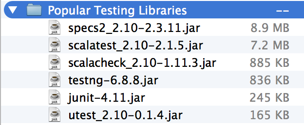

µTest 0.4.8 [![Build Status][travis-badge]][travis-link] [![Gitter Chat][gitter-badge]][gitter-link]
====================================================================================================


[travis-badge]: https://travis-ci.org/lihaoyi/utest.svg
[travis-link]: https://travis-ci.org/lihaoyi/utest
[gitter-badge]: https://badges.gitter.im/Join%20Chat.svg
[gitter-link]: https://gitter.im/lihaoyi/utest?utm_source=badge&utm_medium=badge&utm_campaign=pr-badge&utm_content=badge

uTest (pronounced micro-test) is a lightweight testing library for Scala.
Its key features are:

- [Less than 1000 lines of code](https://github.com/lihaoyi/utest/graphs/contributors)
- [A fancy set of macro-powered asserts](#macro-asserts)
- [A unique execution model](#execution-model)
- [Integration with SBT](#getting-started)
- [Cross compiles to ScalaJS](#scalajs)
- [Cross compiles to Scala Native](http://scala-native.org/)

Contents
--------

- [Getting Started](#getting-started)
- [Defining and Running a Test Suite](#defining-and-running-a-test-suite)
  - [Nesting Tests](#nesting-tests)
  - [Sharing Setup Fixtures](#sharing-setup-fixtures)
  - [Other Ways of Naming tests](#other-ways-of-naming-tests)
  - [Asynchronous Tests](#asynchronous-tests)
- [Macro Asserts](#macro-asserts)
  - [Arrow Asserts](#arrow-asserts)
  - [Intercept](#intercept)
  - [Eventually and Continually](#eventually-and-continually)
  - [Assert Match](#assert-match)
  - [Compile Error](#compile-error)
- [Test Utilities](#test-utilities)
  - [TestPath](#testpath)
  - [Local Retries](#local-retries)
- [Configuring uTest](#configuring-utest)
  - [Output Formatting](#output-formatting)
  - [Suite Retries](#suite-retries)
  -  [Test Wrapping](#test-wrapping)
- [Execution Model](#execution-model)
- [SBT Command-line Interface](#sbt-command-line-interface)
- [ScalaJS](#scalajs)
- [Why uTest](#why-utest)
- [Development Tips](#development-tips)
- [Changelog](#changelog)

Getting Started
===============

Most people coming to uTest will be running tests through
[SBT](http://www.scala-sbt.org/). Add the following to your `build.sbt` and
you can immediately begin defining and running tests programmatically.


```scala
libraryDependencies += "com.lihaoyi" %% "utest" % "0.4.8" % "test"

testFrameworks += new TestFramework("utest.runner.Framework")
```

To use it with Scala.js, swap out the `libraryDependencies` with

```scala
libraryDependencies += "com.lihaoyi" %%% "utest" % "0.4.8" % "test"

testFrameworks += new TestFramework("utest.runner.Framework")
```

Defining and Running a Test Suite
=================================

Put this in your `src/test/scala/` folder:

```scala
package test.utest.examples.examples

import utest._

object HelloTests extends TestSuite{
  val tests = this{
    'test1{
      throw new Exception("test1")
    }
    'test2{
      1
    }
    'test3{
      val a = List[Byte](1, 2)
      a(10)
    }
  }
}
```

You can then run this via
```
sbt myproject/test
```

Which should produce this output:

```javascript
[info] -----------------------Starting Suite test.utest.examples.HelloTests-----------------------
[info] test.utest.examples.HelloTests.test1
[info]      		java.lang.Exception: test1
[info] test.utest.examples.HelloTests.test2		Success
[info] 1
[info] test.utest.examples.HelloTests.test3
[info]      		java.lang.IndexOutOfBoundsException: 10
[info] test.utest.examples.HelloTests		Success
[info] -----------------------------------Results-----------------------------------
[info] test.utest.examples.HelloTests		Success
[info]     test1		Failure('java.lang.Exception: test1')
[info]     test2		Success
[info]          1
[info]     test3		Failure('java.lang.IndexOutOfBoundsException: 10')
[info] Failures:
[info] test.utest.examples.HelloTests.test1
[info]      		java.lang.Exception: test1
[info] test.utest.examples.HelloTests$$anonfun$4$$anonfun$apply$1.apply(HelloTests.scala:8)
[info] test.utest.examples.HelloTests$$anonfun$4$$anonfun$apply$1.apply(HelloTests.scala:6)
[info] test.utest.examples.HelloTests.test3
[info]      		java.lang.IndexOutOfBoundsException: 10
[info] scala.collection.LinearSeqOptimized$class.apply(LinearSeqOptimized.scala:51)
[info] scala.collection.immutable.List.apply(List.scala:83)
[info] test.utest.examples.HelloTests$$anonfun$4$$anonfun$apply$3.apply(HelloTests.scala:15)
[info] test.utest.examples.HelloTests$$anonfun$4$$anonfun$apply$3.apply(HelloTests.scala:6)
[info] Tests: 4
[info] Passed: 2
[info] Failed: 2
[error] Failed tests:
[error] 	test.utest.examples.HelloTests
[error] (utestJVM/test:testOnly) sbt.TestsFailedException: Tests unsuccessful
[error] Total time: 1 s, completed Mar 12, 2016 5:24:54 PM
```

At first the tests are run one at a time; after they've all completed, a summary
is printed, followed by the stack traces for any tests which failed. You can
configure the test suite to change how these things are printed.

Nesting Tests
-------------

Note that tests within the suite can nested within each other, but only
directly. E.g. you cannot define tests within `if`-statements or `for`-loops.
uTest relies on the test structure to be statically known at compile time.
They can be nested arbitrarily deep:

```scala
package test.utest.examples

import utest._

object NestedTests extends TestSuite{
  val tests =  this{
    val x = 1
    'outer{
      val y = x + 1
      'inner{
        val z = y + 1
        'innerest{
          assert(
            x == 1,
            y == 2,
            z == 3
          )
          (x, y, z)
        }
      }
    }
  }
}
```

Which when run prints:

```javascript
[info] -----------------Starting Suite test.utest.examples.NestedTests-----------------
[info] test.utest.examples.NestedTests.outer.inner.innerest		Success
[info] (1,2,3)
[info] test.utest.examples.NestedTests.outer.inner		Success
[info] test.utest.examples.NestedTests.outer		Success
[info] test.utest.examples.NestedTests		Success
[info] -----------------------------------Results-----------------------------------
[info] test.utest.examples.NestedTests		Success
[info]     outer		Success
[info]         inner		Success
[info]             innerest		Success
[info]                     (1,2,3)
[info]
[info] Tests: 4
[info] Passed: 4
[info] Failed: 0
```

As you can see, the various three are nested within each other.

Sharing Setup Fixtures
----------------------

You can use the
nested of tests to group related tests together, and have them share common
initialization code or fixtures by defining them in the enclosing test:

```scala
package test.utest.examples

import utest._

object SharedSetupTests extends TestSuite{
  val tests = this{
    var x = 0
    'A{
      x += 1
      'X{
        x += 2
        assert(x == 3)
        x
      }
      'Y{
        x += 3
        assert(x == 4)
        x
      }
    }
    'B{
      x += 4
      'Z{
        x += 5
        assert(x == 9)
        x
      }
    }
  }
}
```

Here, we are sharing the initialization of the variable `x` between all the
various sub-tests in the same folder.

Despite being shared lexically, these helpers are re-created for each test that
is run, so if they contain mutable state (e.g. mutable collections, or `var`s)
you do not need to worry about the mutations from multiple tests interfering
with each other. This gives lets you concisely share common setup code between
related tests in the same grouping, while avoiding interference between tests
due to mutation of shared fixtures. If you want the fixtures to really-truly be
shared between individual tests, define it outside the `this{}` block:

```scala
package test.utest.examples

import utest._

object SharedFixturesTests extends TestSuite{
  var x = 0
  val tests = this{
    'A{
      x += 1
      'X{
        x += 2
        assert(x == 4)
        x
      }
      'Y{
        x += 3
        assert(x == 8)
        x
      }
    }
    'B{
      x += 4
      'Z{
        x += 5
        assert(x == 21)
        x
      }
    }
  }
}
```

And you'll see that the changes to `x` are being shared between the
invocations of all the tests: `A` increments it by 1, `X` by 1 then 2, to 4,
`Y` by 1 and 3 to 8, and so on. This allows you to avoid doing work repeatedly
initializing things, but you need to be careful the tests aren't mutating
shared state that could interfere! For more detail on this and other things
related to test execution, see [below](#execution-model).

Other Ways of Naming tests
--------------------------

uTest also allows you to use strings to define test keys, if you wish to make
your test names longer and more descriptive:

```scala
"test with spaces"-{
  throw new Exception("test1")
}
'test2-run(1)

```

Note that you can also use the `'symbol-...` syntax, if your tests are concise
and you want to make them *really* concise. The `"string"-{...}`,
`'symbol{...}` and `'symbol-...` syntaxes are all entirely equivalent.

The last way of defining tests is with the `utest.*` symbol, e.g.

```scala
import utest._

val test = TestSuite{
  'test1{
    throw new Exception("test1")
  }
  'test2{
    * - {1 == 1}
    * - {2 == 2}
    * - {3 == 3}
  }
  'test3{
    val a = List[Byte](1, 2)
    a(10)
  }
}
```

Tests defined using the `*` symbol are give the numerical names "0", "1", "2",
etc.. This is handy if you have a very large number of very simple test cases
(perhaps you've delegated the heavy lifting to a helper function), but still
want to be able to run them separately.

Asynchronous Tests
------------------

```scala
val tests = this {
  "testSuccess" - {
    Future {
      assert(true)
    }
  }
  "testFail" - {
    Future {
      assert(false)
    }
  }
  "normalSuccess" - {
    assert(true)
  }
  "normalFail" - {
    assert(false)
  }
}

tests.runAsync().map {    results =>
  assert(results.toSeq(0).value.isSuccess) // root
  assert(results.toSeq(1).value.isSuccess) // testSuccess
  assert(results.toSeq(2).value.isFailure) // testFail
  assert(results.toSeq(3).value.isSuccess) // normalSuccess
}
```

You can have tests which return (have a last expression being) a `Future[T]`
instead of a normal value. You can run the suite using `.runAsync` to return a
`Future` of the results, or you can continue using `.run` which will wait for
all the futures to complete before returning.

In Scala.js, calling `.run` on a test suite with futures in it throws an error
instead of waiting, since you cannot wait in Scala.js.

When running the test suites from SBT, you do not need worry about any of this
`run` vs `runAsync` stuff: the test runner will handle it for you and provide
the correct results.

Macro Asserts
=============

```scala
val x = 1
val y = "2"
assert(
  x > 0,
  x == y
)

// utest.AssertionError: x == y
// x: Int = 1
// y: String = 2
```

uTest comes with a macro-powered `assert`s that provide useful debugging information in the error message. These take one or more boolean expressions, and when they fail, will print out the names, types and values of any local variables used in the expression that failed. This makes it much easier to see what's going on than Scala's default `assert`, which gives you the stack trace and nothing else.

uTest also wraps any exceptions thrown within the assert, to help trace what went wrong:

```scala
val x = 1L
val y = 0L
assert(x / y == 10)

// utest.AssertionError: assert(x / y == 10)
// caused by: java.lang.ArithmeticException: / by zero
// x: Long = 1
// y: Long = 0
```

The origin exception is stored as the `cause` of the `utest.AssertionError`, so the original stack trace is still available for you to inspect.

Arrow Asserts
-------------

```scala
1 ==> 1 // passes
Array(1, 2, 3) ==> Array(1, 2, 3) // passes
try{
  1 ==> 2 // throws
}catch{case e: java.lang.AssertionError =>
  e
}
```

You can use `a ==> b` as a shorthand for `assert(a == b)`. This results in
pretty code you can easily copy-paste into documentation.

Intercept
---------

```scala
val e = intercept[MatchError]{
  (0: Any) match { case _: String => }
}
println(e)

// scala.MatchError: 0 (of class java.lang.Integer)
```

`intercept` allows you to verify that a block raises an exception. This exception is caught and returned so you can perform further validation on it, e.g. checking that the message is what you expect. If the block does not raise one, an `AssertionError` is raised.

As with `assert`, `intercept` adds debugging information to the error messages if the `intercept` fails or throws an unexpected Exception.

Eventually and Continually
--------------------------

```scala
val x = Seq(12)
eventually(x == Nil)

// utest.AssertionError: eventually(x == Nil)
// x: Seq[Int] = List(12)
```

In addition to a macro-powered `assert`, uTest also provides macro-powered versions of `eventually` and `continually`. These are used to test asynchronous concurrent operations:

- `eventually(tests: Boolean*)`: ensure that the boolean values of `tests` all become true at least once within a certain period of time.
- `continually(tests: Boolean*)`: ensure that the boolean values of `tests` all remain true and never become false within a certain period of time.

These are implemented via a retry-loop, with a default retry interval of 0.1 second and retries up to a total of 1 second. If you want to change this behavior, you can shadow the implicit values `retryInterval` and `retryMax`, for example this:

```scala
implicit val retryMax = RetryMax(300.millis)
implicit val retryInterval = RetryInterval(50.millis)
```

Would set the retry-loop to happen every 50ms up to a max of 300ms.

Together, these two operations allow you to easily test asynchronous operations. You can use them to help verify Liveness properties (that condition must eventually be met) and Safety properties (that a condition is never met)

As with `assert`, `eventually` and `continually` add debugging information to the error messages if they fail.

Assert Match
------------

```scala
assertMatch(Seq(1, 2, 3)){case Seq(1, 2) =>}
// AssertionError: Matching failed Seq(1, 2, 3)
```

`assertMatch` is a convenient way of checking that a value matches a particular shape, using Scala's pattern matching syntax. This includes support for use of `|` or `_` or `if`-guards within the pattern match. This gives you additional flexibility over a traditional `assert(a == Seq(1, 2))`, as you can use `_` as a wildcard e.g. using `assertMatch(a){case Seq(1, _)=>}` to match any 2-item `Seq` whose first item is `1`.

As with `assert`, `assertMatch` adds debugging information to the error messages if the value fails to match or throws an unexpected Exception while evaluating.

Compile Error
-------------

```scala
compileError("true * false")
// CompileError.Type("value * is not a member of Boolean")

compileError("(}")
// CompileError.Parse("')' expected but '}' found.")
```

`compileError` is a macro that can be used to assert that a fragment of code (given as a literal String) fails to compile.

- If the code compiles successfully, `compileError` will fail the compilation run with a message.
- If the code fails to compile, `compileError` will return an instance of `CompileError`, one of `CompileError.Type(pos: String, msgs: String*)` or `CompileError.Parse(pos: String, msgs: String*)` to represent typechecker errors or parser errors

In general, `compileError` works similarly to `intercept`, except it does its checks (that a snippet of code fails) and errors (if it doesn't fail) at compile-time rather than run-time. If the code fails as expected, the failure message is propagated to runtime in the form of a `CompileError` object. You can then do whatever additional checks you want on the failure message, such as verifying that the failure message contains some string you expect to be there.

The `compileError` macro compiles the given string in the local scope and context. This means that you can refer to variables in the enclosing scope, i.e. the following example will fail to compile because the variable `x` exists.

```scala
val x = 0

compileError("x + x"),
// [error] compileError check failed to have a compilation error
```

The returned `CompileError` object also has a handy `.check` method, which takes a position-string indicating where the error is expected to occur, as well as zero-or-more messages which are expected to be part of the final error message. This is used as follows:

```scala
    compileError("true * false").check(
      """
    compileError("true * false").check(
                       ^
      """,
      "value * is not a member of Boolean"
    )
```

Note that the position-string needs to exactly match the line of code the compile-error occured on. This includes any whitespace on the left, as well as any unrelated code or comments sharing the same line as the `compileError` expression.

Test Utilities
==============

uTest provides a range of test utilities that aren't strictly necessary, but
aim to make your writing of tests much more convenient and DRY.


TestPath
--------

```scala
package test.utest.examples

import utest._

object TestPathTests extends TestSuite{
  val tests = this{
    'testPath{
      'foo {
        assert(implicitly[utest.framework.TestPath].value == Seq("testPath", "foo"))
      }
    }
  }
}
```

uTest exposes the path to the current test to the body of the test via the
`utest.framework.TestPath` implicit. This can be used to

One example is the Fastparse test suite, which uses the name of the test to
provide the repository that it needs to clone and parse:

```scala
def checkRepo(filter: String => Boolean = _ => true)
             (implicit testPath: utest.framework.TestPath) = {
  val url = "https://github.com/" + testPath.value.last
  import sys.process._
  val name = url.split("/").last
  if (!Files.exists(Paths.get("target", "repos", name))){
    println("CLONING")
    Seq("git", "clone", url, "target/repos/"+name, "--depth", "1").!
  }
  checkDir("target/repos/"+name, filter)
}

"lihaoyi/fastparse" - checkRepo()
"scala-js/scala-js" - checkRepo()
"scalaz/scalaz" - checkRepo()
"milessabin/shapeless" - checkRepo()
"akka/akka"- checkRepo()
"lift/framework" - checkRepo()
"playframework/playframework" - checkRepo()
"PredictionIO/PredictionIO" - checkRepo()
"apache/spark" - checkRepo()
```

This allows us to keep the tests DRY - avoiding having to repeat the name of
the repo in the name of the test for every test we define - as well as ensuring
that they always stay in sync.

If you need additional metadata such as line-numbers or file-paths or class or
package names, you can use the [SourceCode](https://github.com/lihaoyi/sourcecode)
library's implicits to pull them in for you.

Local Retries
-------------

```scala
object LocalRetryTests extends utest.TestSuite{
  val flaky = new FlakyThing
  def tests = this{
    'hello - retry(3){
      flaky.run
    }
  }
}
```

You can wrap individual tests, or even individual expressions, in a `retry`
block to make them retry a number of times before failing. That is very useful
for dealing with small points of flakiness within your test suite. A `retry`
block simply retries its body up to the specified number of times; the first
run that doesn't throw an exception returns the value returned by that run.

You can also use [Suite Retries](#suite-retries) if you want to configure
retries more globally across your test suite.

Configuring uTest
=================

uTest allows for some basic configuration:

Output Formatting
-----------------

You can control how the output of tests gets printed via overriding methods
on the `TestSuite` object:

```scala
/**
 * Override this to control how individual test results get pretty-printed
 * while a test run is in progress; return `None` to print nothing
 */
def formatSingle(path: Seq[String], r: Result): Option[String]
/**
 * Override this to control how the entire suite gets pretty-printed; return
 * `None` to print nothing.
 */
def format(results: Tree[Result]): Option[String]

/**
 * Controls how many characters are printed for any test results before or
 * the contents of variables in failed assertions before it gets truncated
 */
def utestTruncateLength: Int
/**
 * Whether output gets printed in color
 */*
def formatColor: Boolean
```

Note that you can override these on every `TestSuite` individually, to
configure them differently for each set of tests if you want. If you want
to share your configuration across every test, pull these into a custom
`MyTestSuite` class extending `TestSuite` and have your test suites extend
from `MyTestSuite` instead.

Suite Retries
-------------

You can mix in the `TestSuite.Retries` trait and define the `utestRetryCount`
int to enable test-level retries for all tests within a suite:

```scala

object SuiteRetryTests extends TestSuite with TestSuite.Retries{
  override val utestRetryCount = 3
  val flaky = new FlakyThing
  def tests = this{
    'hello{
      flaky.run
    }
  }
}

```

You can also use [Local Retries](#local-retries) if you want to only retry
within specific tests or expressions instead of throughout the entire suite.

Test Wrapping
-------------
uTest exposes the `utestWrap` function that you can override on any test suite:

```scala
def utestWrap(runBody: => concurrent.Future[Any])
               (implicit ec: ExecutionContext): concurrent.Future[Any]
```

This is a flexible function that wraps every test call; you can use it to
perform initialization before evaluating `runBody`, or to perform cleanup
after the completion of `runBody` via `runBody.onComplete`, or even to perform
retries by executing `runBody` multiple times. If you want to perform messy
before/after logic around every individual test, override `utestWrap`.

`runBody` is a future to support asynchronous testing, which is the only way
to test things like Ajax calls in [Scala.js](#scalajs)

Per-Run Setup/Teardown
----------------------

If you need to perform some action (initialize a database, cleanup the
filesystem, etc.) not just per-test but per-run, you can do that by defining
a custom `utest.runner.Framework` and overriding the `setup` and `teardown`
methods:

```scala
class CustomFramework extends utest.runner.Framework{
  override def setup() = {
    println("Setting up CustomFramework")
  }
  override def teardown() = {
    println("Tearing down CustomFramework")
  }
}
```

And then telling SBT to run tests using the custom framework:

```scala
testFrameworks += new TestFramework("test.utest.CustomFramework"),
```

This is handy for setup/teardown that is necessary but too expensive to do
before/after every single test, which would be the case if you used
[Test Wrapping](#test-wrapping) to do it.

Execution Model
===============

```scala
val test = TestSuite{
  var x = 0
  'A{
    x += 1
    'X{
      x += 2
      assert(x == 3)
    }
    'Y{
      x += 3
      assert(x == 4)
    }
  }
  'B{
    x += 4
    'Z{
      x += 5
      assert(x == 9)
    }
  }
}

val results = test.run()
println(results.leaves.count(_.value.isSuccess)) // 3
```

The example above demonstrates a subtlety of how uTest suites are run: despite all the tests being able to refer to the same lexically-scoped value `x`, each tests modifications to `x` happen entirely independently of the others, allowing all three of the leaf-tests to pass. This allows you to easily place re-usable fixtures anywhere convenient within the test tree.

If you want to create a shared resource that is lazily initialized when needed in one of the tests and used throughout them, simply make it a `lazy val` outside the `TestSuite{ ... }` block.

Test-discovery is done entirely at compile-time by the `TestSuite{ ... }` macro, and is independent of execution of the tests:

```scala
val tests = TestSuite{
  timesRun += 1
  'A{
    assert(false)
    'B{
      'C{
        1
      }
    }
  }
}

// listing tests B and C works despite failure of A
println(tests.toSeq.map(_.name)) // Seq(_, A, B, C)
```

As you can see, even though the `assert(false)` comes before the declaration of tests `B` and `C`, these tests are still listable and inspectable because they were registered at compile time using the `TestSuite{ ... }` macro.

Having a clean separation between test-discovery and test-execution is generally considered to be a good thing, and uTest's execution model strictly enforces this by doing test-discovery at compile-time. Thus, you can always inspect the test hierarchy without having to execute arbitrary test code. At the same time, uTest preserves all the convenience of sharing common setup code via lexical scoping, while avoiding the pitfall of shared-state between tests, giving you the best of both worlds in terms of convenience and isolation.

SBT Command-line Interface
==========================

```
sbt> test
```

Runs all tests in your project. Tests are defined in any class inheriting from
`TestSuite`, e.g.:

```scala
package HelloTests


object HelloTestsuite extends TestSuite{
  val tests = this{
    'hello{
      'world{
        val x = 1
        val y = 2
        assert(x != y)
        (x, y)
      }
    }
    'test2{
      val a = 1
      val b = 2
      assert(a == b)
    }
  }
}
```

If you want to only run a particular test file:

```

sbt> test-only -- HelloTests.HelloTestsuite

```

Or even a particular test within a particular file

```
sbt> test-only -- HelloTests.HelloTestsuite.hello
sbt> test-only -- HelloTests.HelloTestsuite.hello.world
sbt> test-only -- HelloTests.HelloTestsuite.test2
```

The total number of tests includes the non-leaf tests like `hello` and
`HelloTestsuite`. Also, the tests which return a value (like `world`) have
that value printed out inside the `Success()` tag: this is handy for doing a
visual sanity-check at the end of the run to make sure the tests are doing what
you think they are


ScalaJS
=======

uTest is completely compatible with ScalaJS: the above sections on defining
a test suite, asserts and the test-running API all work unchanged under
ScalaJS, with minor differences:

- ScalaJS does not support parallelism, and as such only single-threaded
  `ExecutionContexts` like `utest.ExecutionContext.runNow` or
  `scala.scalajs.concurrent.JSExecutionContext.runNow` work. When run via SBT,
  `--parallel` has no effect.
- [eventually](#eventually) and [continually](#continually) are not supported,
  as they rely on a blocking retry-loop whereas you can't block in ScalaJS

Apart from these differences, there should be no problem compiling uTest
TestSuites via ScalaJS and running them using Rhino or in the browser.

Why uTest
=========

uTest began as an attempt to port [ScalaTest](http://www.scalatest.org/) and
[Specs2](http://etorreborre.github.io/specs2/) to [ScalaJS](). After struggling
with that, I realized that both ScalaTest and Specs2 were going to be difficult
to port to ScalaJS for a few reasons:

- They have a large number of dependencies on JVM-specific things, such as
  [Symbols or Reflection](http://www.scalatest.org/user_guide/using_matchers#checkingArbitraryProperties)
  or [ClassLoaders](), which are not supported by ScalaJS
- They have huge codebases: [400,000 lines of code for
  ScalaTest](https://github.com/scalatest/scalatest/graphs/contributors) and
  [50,000 lines for Specs2](https://github.com/etorreborre/specs2/graphs/contributors).
  This huge mass of code makes it difficult to pinpoint the parts which are
  incompatible with ScalaJS.

If you don't believe that uTest is much smaller than the alternatives, let the
jars speak for themselves:



uTest tries to provide most of what you want as a developer, while leaving out
all the unnecessary functionality that ScalaTest and Specs2 provide:

- Fluent English-like code: matchers like [`shouldBe` or `should not
  be`](http://www.scalatest.org/user_guide/using_matchers#checkingForEmptiness)
  or [`mustbe_==`](http://etorreborre.github.io/specs2/guide/org.specs2.guide.Matchers.html)
  don't really add anything, and it doesn't really matter whether you name each
  test block using [`should`, `when`, `can`,
  `must`](http://doc.scalatest.org/2.0/#org.scalatest.Spec),
  [`feature("...")`](http://doc.scalatest.org/2.0/#org.scalatest.FlatSpec)
  or [`it should "..."`](http://doc.scalatest.org/2.0/#org.scalatest.FlatSpec)
  These add nothing and clutter up the API and code base. You certainly don't
  need [8 different sets of them](http://www.scalatest.org/user_guide/selecting_a_style).
- Legacy code, like ScalaTests [time
  package](http://doc.scalatest.org/2.0/#org.scalatest.time.package), now
  obsolete with the introduction of
  [scala.concurrent.duration](http://www.scala-lang.org/api/current/index.html#scala.concurrent.duration.package).
- Such a a rich command-line interface: with a simple API, any user who wants
  to do heavy customization of the test running can simply do it in code, and
  writing a small amount of Scala with a trivial command-line runner will likely
  be easier than wrestling with mountains of command-line configuration flags
  to try to make the runner do what you want.

While improving on the basic things that matters

- Better [macro-asserts](#macro-assserts) which are both more-useful and
  more-simply-implemented than those provided by ScalaTest
- Compile-time test registration, which allows [completely separating
  test-discovery and execution](#execution-model).
- A simpler, straightforward [API](#test-running-api) that makes using uTest
  as a library much easier.
- Raw size: at less than 1000 lines of code, uTest is 1/400th the size of
  [ScalaTest](https://github.com/scalatest/scalatest/graphs/contributors) and
  1/50th the size of [Specs2](https://github.com/etorreborre/specs2/graphs/contributors),
  and with almost no dependencies. Its small size means that you can trivially
  use uTest as a library within a larger application without worrying about it
  significantly increasing the size of your packaged artifacts, or pulling in
  weird dependencies.

Development Tips
================

To run all the test on the entire matrix of Scala versions (2.10.4 and 2.11.0)
and backends (JVM and JS), simply run:

    sbt +test

You can also use more targeted commands e.g. `utestJS/test` which would only
re-test the Javascript backend under scala 2.10.4.

To publish use

    sbt +publishSigned

Changelog
=========

0.5.0
-----

- Stack traces for chained exceptions (i.e. those with a `.getCause != null`)
  are now properly displayed when tests fail

- Portions of stack traces caused by the internals of the `assert` macros are
  now hidden, since they aren't relevant to any failure in user code

- Revamped test output format, motivated by
  [drhumlen](https://github.com/drhumlen)'s
  [PR 113](https://github.com/lihaoyi/utest/pull/113), which should be much
  easier to read and skim

- Much smarter test-output-value truncation, now based on lines-of-output
  (including wrapping) rather than number-of-characters

- Line-wrapping of output is now indentation aware: it wraps to the next line
  with the same indentation, preserving the outline of indentation on the left
  making it easier to skim

- How long tests take is now displayed in the standard test output format

- Hierarchical test summary and failure-summary are now only shown when you have
  a large number of tests, since it's not use when running individual or small
  numbers of tests. The default threshold is 20, which can be configured by
  defining a custom framework overriding `showSummaryThreshold`

- Revamped test-query system, now allowing you to run multiple groups of tests
  at once via `test-only -- mypackage.{foo,bar,baz}` or `{mypackage,
  myotherpackage}` or `mypackage.{foo,bar.{baz,qux}}`

- Overhauled the [Execution Model](#execution-model) of test suites: now only
  the inner-most blocks within your `TestSuite{...}` block count as tests, and
  the surrounding blocks do not. Thus the surrounding blocks no longer show
  pass/fail status, return a test result-value, or get run independently.

- Various user errors (non-existent test, non-existing test suite, invalid test
  query syntax) now give slightly more friendly error messages

- Using uTest with `fork in Test := true` in SBT no longer gives an incorrect
  results summmary

- Fix problem with lazy vals in test blocks crashing the compiler
  [#67](https://github.com/lihaoyi/utest/issues/67). Note that the issue is only
  fixed on 2.12.3, and not on Scala 2.10.x or 2.11.x.


0.4.8
-----

- Scala Native support.

0.4.7
-----

- Scala 2.13 support
- Compile for Scala 2.12 with method optimisations (`-opt:l:method`)

0.4.6
-----

* Upgrade Scala.JS to 0.6.16.
* Upgrade Scala to 2.11.11 and 2.12.2.
* Avoid using `getStackTraceString` deprecated in Scala 2.13

0.4.5
-----

- Catch Fatal exceptions like ClassCasts in Scala.JS.

0.4.4
-----

- Scala 2.12 support

0.4.3
-----

- Generalize `==>` asserts to work on `Array`s
- Shiny new [CI build](https://travis-ci.org/lihaoyi/utest) and [Gitter Chat](https://gitter.im/lihaoyi/utest?utm_source=badge&utm_medium=badge&utm_campaign=pr-badge&utm_content=badge)

0.4.2
-----

- Move errors into `utest.*` from `utest.framework.*`
- Removed `acyclic` hack variable

0.4.1
-----

- Fix usage of by-name function calls within tests #55

0.4.0
-----

- `foo: @Show` annotation lets you tell uTest to print out arbitrary expressions
  within the test suite when things fail, in addition to the default of local
  variables

- You can use `a ==> b` to assert equality within a test suite, in a form that's
  pretty enough to use as documentation

- `compileError` now properly passes when an expression would fail to compile
  due to `@compileTimeOnly` annotations

- [Configuring uTest](#configuring-utest) has been overhauled.

- Scala `2.12.0-M3` support

- Fix some warnings appearing when the `-Ydead-code` flag is used

- Added [TestPath](#testpath) implicit to make the path to the current test
  available for usage inside the test body or helpers.

0.3.1
-----

- Published for Scala.js 0.6.1

0.3.0
-----

- Published for Scala.js 0.6.0
- Removed `JsCrossBuild` now that Scala.js supports cross-building via `crossProject`
- `compileTimeOnly` has been re-introduced, so invalid use of test DSL should fail with nice errors
- Removed `--throw` flag in favor of "native" SBT error reporting

0.2.4
-----

- Added support for asynchronous tests which return a `Future`.

0.2.3
-----

- Updated to work against ScalaJS 0.5.4

0.2.2
-----

- Introduced `CompileError.check(pos: String, msgs: String*)` to simplify the common pattern of checking that the error occurs in the right place and with the message you expect.
- Changed the file layout expected by `JsCrossBuild`, to expect the shared files to be in `js/shared/` and `jvm/shared/`, rather than in `shared/`. This is typically achieved via symlinks, and should make the cross-build play much more nicely with IDEs.

0.2.1
-----

- Fix bug in `utestJsSettings` pulling in the wrong version of uTest

0.2.0
-----
- Introduced the `compileError` macro to allow testing of compilation errors.
- Stack traces are now only shown for the user code, with the uTest/SBT internal stack trace ignored, making them much less spammy and noisy.
- Introduced the `*` symbol, which can be used in place of a test name to get sequentially numbered test names.

0.1.9
-----


- ScalaJS version is now built against ScalaJS 0.5.3
- Fixed linking errors in ScalaJS version, to allow proper operation of the new optimization

0.1.8
-----

- Fixed bug causing local-defs in assert macro to fail

0.1.7
-----

- Extracted out `utestJvmSettings` and `utestJsSettings` for use outside the `JsCrossBuild` plugin, for people who don't want to use the plugin.

0.1.6
-----

- Print paths of failing tests after completion to make C&P-ing re-runs more convenient
